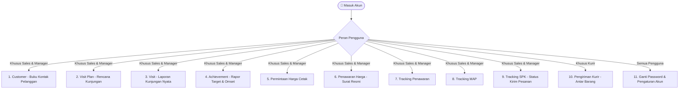

# PlanToday - Mobile Application Client

PlanToday adalah aplikasi mobile berbasis **React Native (CLI)** yang digunakan untuk mendukung operasional divisi Sales, Manajemen, dan Logistik/Kurir. Aplikasi ini mencakup manajemen kunjungan sales, pelacakan target & omset (achievement), operasional pengiriman kurir, pembuatan penawaran harga, pelacakan SPK, serta pengajuan permintaan harga cetak.

Aplikasi ini dibangun menggunakan **TypeScript** dan berkomunikasi dengan backend layanan REST API PlanToday.

---

## 📱 Panduan Fitur & Menu Aplikasi
Aplikasi PlanToday memiliki menu yang disesuaikan dengan peran kerja pengguna (**SALES**, **MANAGER**, dan **KURIR**):



---

### Penjelasan Menu Secara Sederhana:

#### 1. 👥 Customer (Buku Kontak Calon Pelanggan)
* **Apa gunanya?** Tempat mencatat dan menyimpan daftar calon pelanggan atau toko/instansi yang ingin diprospek.
* **Cara pakainya:** Sales memasukkan nama usaha, alamat toko, nomor telepon, dan orang yang bisa dihubungi (PIC). Jika butuh membagikan data ke tim, ada tombol praktis untuk menyalin ringkasan data ke WhatsApp.

#### 2. 📅 Visit Plan (Rencana Jadwal Kunjungan)
* **Apa gunanya?** Membantu sales menyusun jadwal agenda kerja harian atau mingguan agar terencana dengan rapi.
* **Cara pakainya:** Pilih pelanggan yang ingin didatangi, tentukan tanggal rencananya, dan tulis tujuan kunjungan (misalnya: perkenalan produk, follow up penawaran, atau penagihan).

#### 3. 📍 Visit (Laporan Kunjungan Lapangan)
* **Apa gunanya?** Mencatat bukti bahwa sales benar-benar sudah datang dan bertemu dengan pelanggan di lokasi.
* **Cara pakainya:** Saat tiba di tempat pelanggan, sales membuka menu ini untuk *check-in*, menjepret foto langsung di lokasi, mencatat hasil pembicaraan, dan sistem otomatis merekam titik lokasi GPS saat itu.

#### 4. 📊 Achievement (Rapor Target Penjualan & Omset)
* **Apa gunanya?** Melihat performa penjualan pribadi maupun tim apakah sudah mencapai target bulanan/tahunan.
* **Cara pakainya:** Tampil grafik batang dan persentase yang mudah dilihat. Sales bisa mengecek berapa omset yang sudah dikumpulkan bulan ini, dan Manager bisa melihat perbandingan performa seluruh anggota tim sales.

#### 5. 💰 Permintaan Harga (Hitung Biaya Cetak / Custom)
* **Apa gunanya?** Meminta bantuan tim kalkulator/estimator pabrik untuk menghitung harga barang custom sebelum dibuatkan surat penawaran resmi.
* **Cara pakainya:** Sales mengisi spesifikasi barang (ukuran, jenis kertas/bahan, finishing, dan jumlah pesanan) serta mengunggah hingga 5 foto contoh produk/sampel.

#### 6. 📄 Penawaran Harga (Pembuatan Surat Penawaran Resmi)
* **Apa gunanya?** Membuat draf surat penawaran harga resmi dengan kop surat perusahaan untuk diserahkan ke pelanggan.
* **Cara pakainya:** Pilih nama pembeli, masukkan daftar barang yang ingin dibeli beserta harganya, lalu aplikasi otomatis menghitung total harga dan PPN. Hasilnya bisa langsung diekspor menjadi dokumen PDF resmi.

#### 7. 📌 Tracking Penawaran (Pantau Status Penawaran)
* **Apa gunanya?** Memantau nasib surat penawaran yang sudah dikirim ke pelanggan.
* **Cara pakainya:** Sales bisa melihat penawaran mana yang masih tahap negosiasi, yang sudah berhasil *Deal* (menjadi order), atau yang batal (*Lost*).

#### 8. 🗺️ Tracking MAP (Pantau Memo SPK Pabrik)
* **Apa gunanya?** Memantau alur berkas lembar kerja pesanan (Memo SPK) yang sedang diproses di internal operasional dan pabrik.

#### 9. 📋 Tracking SPK (Pantau Jadwal & Status Kirim Barang)
* **Apa gunanya?** Mengetahui apakah barang pesanan pelanggan yang diproduksi sudah selesai dan berapa banyak yang sudah dikirim ke alamat pembeli.
* **Cara pakainya:** Menampilkan ringkasan status pengiriman yang sangat jelas:
  * 🔴 **Belum Kirim**: Barang masih proses produksi di pabrik.
  * 🟡 **Sebagian**: Sebagian barang sudah dikirim dengan Surat Jalan, sisanya menyusul.
  * 🟢 **Selesai**: Seluruh pesanan sudah tuntas dikirim ke pelanggan.

#### 10. 🚚 Pengiriman Kurir *(Khusus Bagian Kurir - Masih Dalam Pengembangan)*
* **Apa gunanya?** Membantu kurir mengantar barang sesuai daftar Surat Jalan dan mencatat tanda terima pengantaran.
* **Cara pakainya:** Kurir melihat rute/jadwal kirim, lalu saat menyerahkan paket ke pembeli, kurir mengambil foto barang diterima (*bukti serah terima*) dan sistem mencatat lokasi GPS pengantaran.

#### 11. 🔐 Ganti Password & Akun
* **Apa gunanya?** Mengganti kata sandi login akun sendiri sewaktu-waktu agar tetap aman.

---

## 🛠️ Tech Stack & Dependensi Utama

- **Core**: React Native v0.83.x, React v19.x, TypeScript.
- **Navigasi**: React Navigation v7 (`@react-navigation/native-stack`).
- **State & Autentikasi**: React Context API (`AuthProvider`).
- **HTTP Client**: Axios dengan interseptor Request Deduplication.
- **UI & Grafis**:
  - `react-native-vector-icons` (Material Icons).
  - `react-native-svg` & `react-native-gifted-charts` (visualisasi diagram/grafik).
  - `react-native-linear-gradient` (antarmuka modern).
- **Layanan Native & Hardware**:
  - `@react-native-async-storage/async-storage` (penyimpanan token sesi lokal).
  - `react-native-geolocation-service` (perekaman GPS koordinat kunjungan & kurir).
  - `react-native-image-picker` & `react-native-image-resizer` (kamera & kompresi foto).
  - `react-native-html-to-pdf` & `react-native-share` (ekspor & bagikan dokumen PDF).

---

## 📂 Struktur Direktori Proyek

```
PlanToday/
├── android/                  # Konfigurasi native Android (Gradle, Manifest, Keystore)
├── ios/                      # Konfigurasi native iOS (Podfile, Xcode)
├── components/               # Komponen UI global (Loading skeleton, custom header, modal)
├── context/                  # Global state management (AuthProvider, User context)
├── navigation/               # Navigasi stack & pembatasan akses menu (Role Guard)
├── screens/                  # Halaman antarmuka pengguna dikelompokkan per modul:
│   ├── Login/ & Register/    # Layar autentikasi & registrasi
│   ├── Home/                 # Dashboard utama, Calon Customer, & Visit Plan/Record
│   ├── Achievement/          # Layar visualisasi grafik target/realisasi omset
│   ├── Kurir/                # Layar operasional pengiriman kurir & bukti kirim
│   ├── Penawaran/            # Layar penawaran harga, tracking penawaran, MAP, & SPK
│   └── PermintaanHarga/      # Layar formulir & tracking permintaan harga
├── services/                 # API service, Axios client, & handler pembaruan aplikasi
└── utils/                    # Utilitas format tanggal, validasi input, & pencegah double click
```

---

## ⚙️ Panduan Menjalankan Aplikasi di Lokal

### 1. Prasyarat Lingkungan

- **Node.js**: Versi `>= 20.x`
- **JDK**: Java Development Kit versi `17`
- **Android SDK**: Android SDK Platform 34 atau terbaru terkonfigurasi di `ANDROID_HOME`
- **Perangkat**: Emulator Android / Perangkat fisik dengan USB Debugging aktif

### 2. Instalasi Dependensi

```bash
npm install
# atau untuk instalasi bersih
npm ci
```

### 3. Konfigurasi Endpoint API

Konfigurasi alamat server backend di file [env.tsx](file:///d:/Coding/PlanToday/env.tsx) atau [services/api.tsx](file:///d:/Coding/PlanToday/services/api.tsx):

```typescript
// Contoh endpoint untuk emulator Android lokal
export const PUBLIC_API_ORIGIN = 'http://10.0.2.2:3001';

// Contoh endpoint untuk server staging / VPS
// export const PUBLIC_API_ORIGIN = 'http://api.example.com:3001';
```

### 4. Menjalankan Aplikasi

Buka terminal dan jalankan Metro bundler:

```bash
npm start
```

Buka terminal kedua dan jalankan aplikasi pada emulator/device Android:

```bash
npm run android
```

---

## 🛡️ Mekanisme Request Deduplication (Axios)

Aplikasi dilengkapi interseptor Axios kustom untuk mencegah pengiriman request mutasi ganda (_double submit_ pada tombol):

- Jika pengguna menekan tombol submit berkali-kali secara cepat, request berikutnya yang identik (berdasarkan kombinasi `Method + URL + Query Params + Data Payload`) akan dibatalkan secara otomatis hingga request pertama selesai.
- Mencegah duplikasi data calon customer, penawaran ganda, maupun double check-in kunjungan.

---

## 📦 Alur Rilis & Deployment Otomatis (CI/CD)

Proses kompilasi APK rilis dikelola secara otomatis melalui GitHub Actions (`.github/workflows/android-release-vps.yml`):

1. **Pemicu**: Push commit ke branch `main`.
2. **Kompilasi**: Gradle membangun berkas APK Release bertanda tangan digital (_keystore_).
3. **Distribusi**: APK dan manifes rilis `latest.json` diunggah ke server unduhan, sehingga pengguna mendapatkan notifikasi pembaruan in-app secara otomatis.
